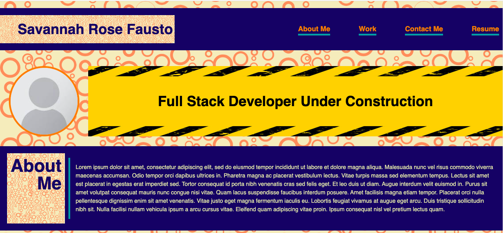
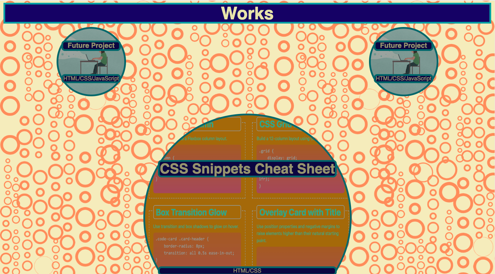
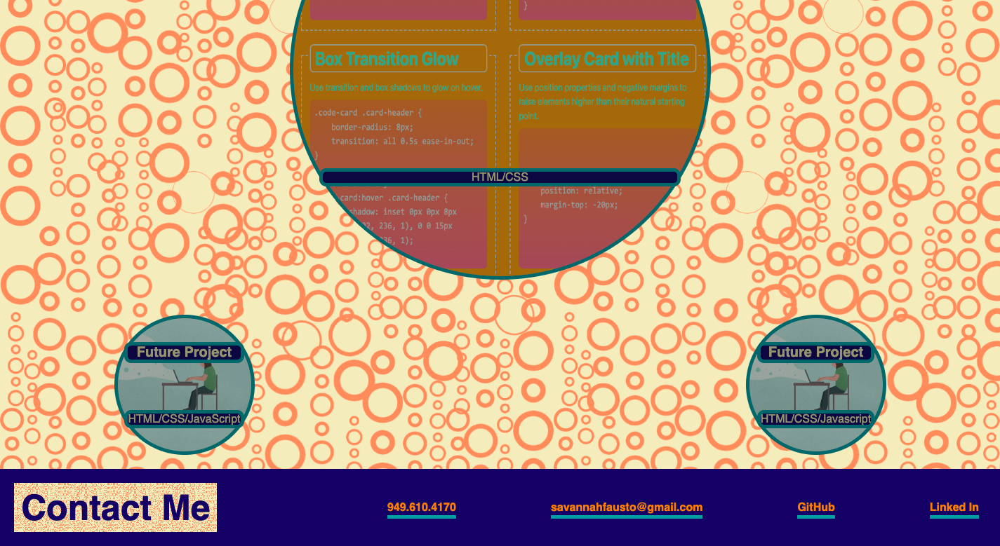

# A Breakdown of Professsional Portfolio Challenge

## Purpose of Week 2 Challenge: Demonstrate Advanced CSS Skills
For this week's challenge, a professional portfolio was built from scratch using advanced CSS skills such as: 
* Flexbox
* Media Queries
* CSS Variables

Although, at the moment, there is only one accessible work, this webpage will be updated as more works are developed and ready for showcasing.

## The Process: 

The index.HTML file contains semantic elements with as many specific class names to make the file more readible. 

When creating the web application, one section of html was created, and then the corresponding CSS in the style.css sheet was created. This allowed for immediate edits to be made to the style.css if needed.

Once the basic HTML and CSS was complete, pseudo classes were added to the works section of the page.

Finally, media queries were added to allow for better viewing on smaller viewports such as tablets and phones. As the viewport screen decrease, breakpoints where the webpage would benefit from altered CSS were noted. Then for each breakpoint, CSS was altered to make the webpage UI more appealing at and before each breakpoint.  

## Additional Concepts Learned: 

This challenge, was exactly that, a challenge; it allowed for a lot of learning which was exciting and difficult all at the same time. 

The style sheet has some comments about new to me properties that are summarized below: 
* background-image properties
* grid properties

The style sheet also has comments above flexbox properties, pseudo classes and media queries. 

## Future Development: 

Besides updating the webpage when more works are completed, I would like to make the background and the body flow together more by placing smaller bubbles sparsely on top of and around the body's content. I would also like to add more pseudo-classes to other parts of the web page besides the works section, while also updating the pseudo-classes in the works section to have a jumping effect when hovering on an individual work. And I'm sure, much more!

## Mock-Up of Savannah Fausto's Portfolio Webpage

##Link to Savannah Fausto's Porfolio
[Savannah Fausto's Porfolio](https://savannahfausto.github.io/Challenge_2_SavannahFausto_First_Portfolio/)
